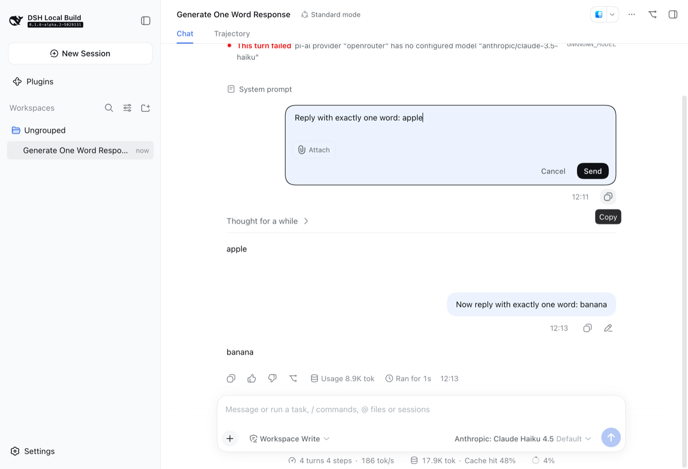
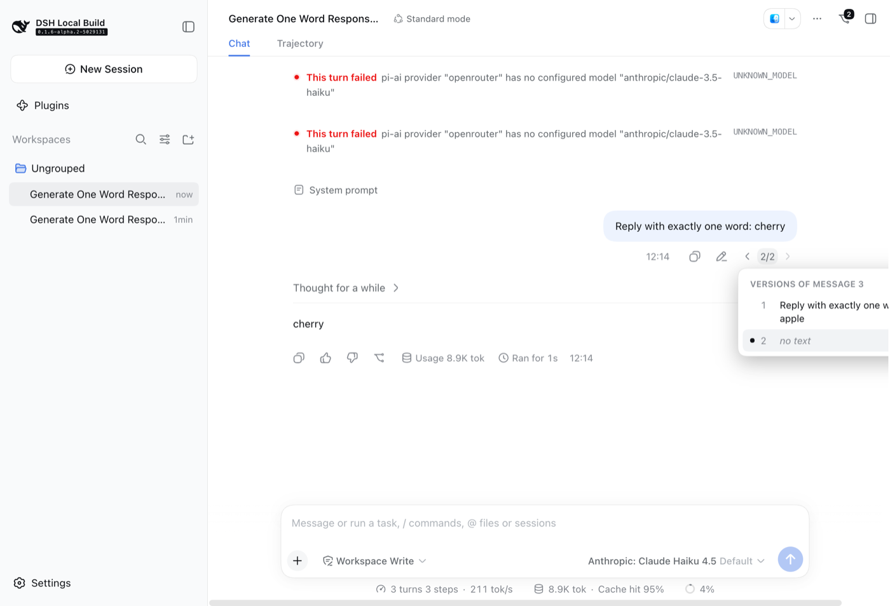
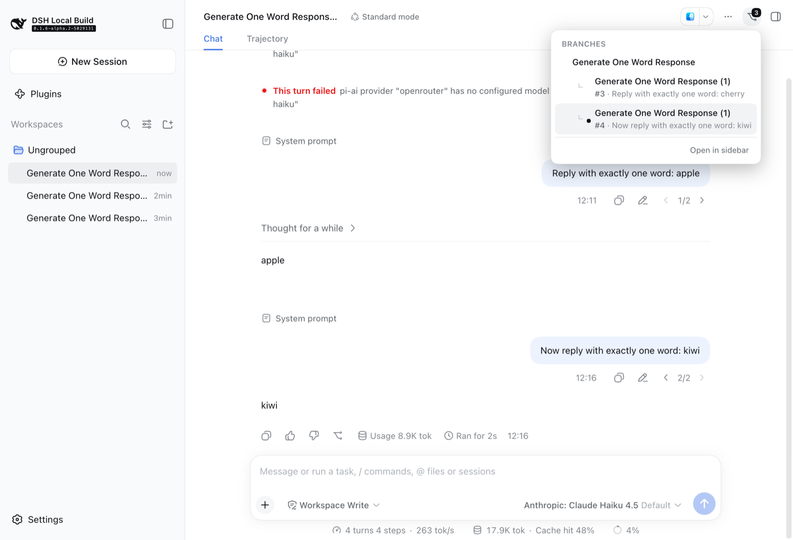
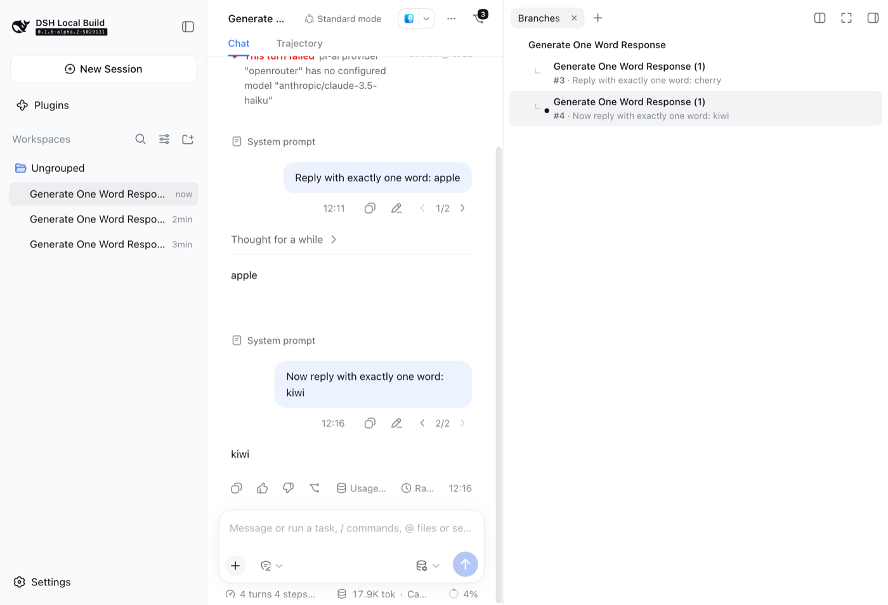
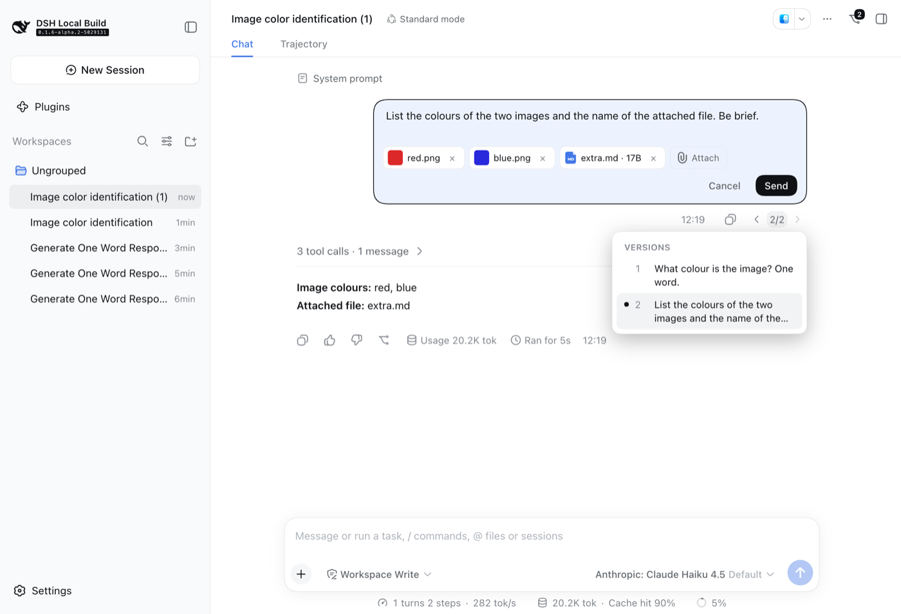
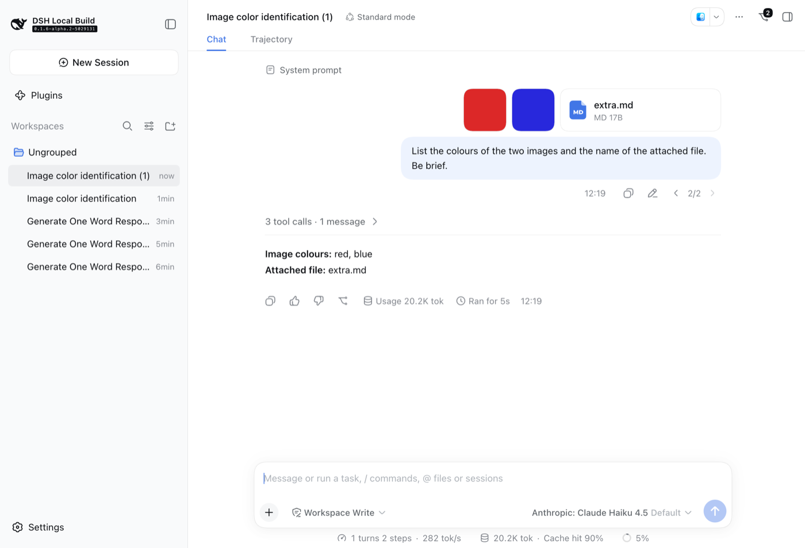

# tali-message-branches

Edit a sent user message — text and attachments — into a new branch of the
conversation, step between the versions of an edited message, and navigate
the tree of branches. DSH plugin, both halves (`index.js` host routes,
`src/client` browser UI). Recipe with the design story and trial log:
`recipes/message-branches-plugin.md`.

## What you get

- **Edit** (pencil) in every user message's actions row. The bubble becomes an
  editor: the text, the original attachments as removable chips, **Attach**
  (or paste) for new images and files, Cancel / Send (Enter sends, Esc
  cancels). Send forks the session *before that message's turn*, queues the
  edited prompt in the fork and opens it. The original conversation is
  untouched.
- **‹ 2/3 ›** under a message that has other versions: arrows step through
  them (each version is a session; switching opens it), the counter lists
  every version's first line.
- **Branches** (branch icon, Session header, top right; a count badge when
  there is more than one): a popover with the whole tree — root first, every
  branch under the session it left, labelled `#turn · first line of the edited
  prompt`; the session on screen is marked. **Open in sidebar** puts the same
  tree in a right-sidebar tab (`branches`; also on the sidebar's guide page).
- DSH's own **Branch into a new conversation** (assistant side) creates the
  same kind of fork, so those branches appear in the tree and as versions of
  the *following* user message.

## Screenshots

| Editing a sent message | Versions of a message |
|---|---|
|  |  |

| The tree (header popover) | The tree (sidebar tab) |
|---|---|
|  |  |

| Editing attachments too | The branch, with the edited attachments |
|---|---|
|  |  |

## How it works

A branch is a DSH fork session: `header.parentSession` names the source,
`isSeeded: true`, and the inherited prefix is every event before the edited
turn (the same cut `session.fork` makes: one past the previous `turn/end`;
for the first message, the events before the first inbox splice). The child's
own first turn number continues the prefix, so "turn N" names the same
position in every member of a family. Two sessions are *versions of the same
message* when their ancestor chains agree on every turn below N and each has
its own turn N (`shared/branches.mjs` `siblingsAt`; unit-tested).

Host routes (`index.js`, behind the normal browser auth):

| Route | Purpose |
|---|---|
| `GET /api/message-branches/tree?sessionId=` | The session's family: root, every fork descendant, each descendant's first own turn, and a first-line preview of every member's prompt at the family's branch turns. Headers from `ctx.sessionQuery.listSessions()`; cuts/previews from one observation per member, cached (cuts forever, the family for `treeCacheSeconds`). |
| `POST /api/message-branches/edit` | `{ sessionId, turn, text, keep: [attachmentId], images: [{ mediaType, data, name? }], files: [{ receiptId }] }` → `{ sessionId }` of the branch. |

The edit route stores the child **cold** through `ctx.sessionPersistence`
(seeded header, prefix, `session/end-seed { inherited: true }`), attaches it
to the source's workspace, resumes it through `ctx.sessionController`
(so the per-session model selection, preset and retirement are the
controller's, exactly as for a resumed fork), clears any inbox item the
prefix replayed, and `agent.followup()`s the edited prompt: kept attachment
blocks (durable refs, original order) → newly admitted images
(`ctx.attachments.admitPromptContent`) → new files (receipts staged against
the *source* session by the shipped upload service, resolved with
`ctx.fileUploads.resolve`) → text. Why not `session.fork` + `session.prompt`:
the gateway's fork refuses a cut before the first completed turn, and its
prompt wire cannot cite an existing attachment.

Browser half: the `user` cell of `conversation.chat.node` is re-registered at
priority −10 (a port of ui-chat's bubble — its CSS-module classes are hashed,
so the plugin carries its own stylesheet, injected as one `<style>`); the
switcher and versions list read the family through the inject `hooks`
compartment (`FamilyCache`, one observable per session, refetched after an
edit, when the session list changes membership, and a few times after a fork
until the new branch's own prompt has landed); the header action and sidebar
tab share one `BranchTreeView`. After an edit the client adopts the child
(`sessions.create({ sessionId })`), renames it `<parent title> (n)` with n
one past the highest existing sibling number, opens it.

## Install

```sh
cd plugins/message-branches && pnpm install --ignore-scripts && pnpm build
# trial: a row in cordis.dev.yml → pnpm dev-overlay → restart the preview
# live:  dsh plugin --profile web add ./plugins/message-branches   (boot-time; restart)
```

Config (row `config`, all optional): `treeCacheSeconds` (default 3),
`previewChars` (default 160).

## Limitations

- Steering messages (sent into a running turn) have no Edit: a fork can only
  cut at a turn boundary.
- The sidebar lists branches as ordinary sessions of the workspace (this
  build of the client nests only subagent children); the tree is the place
  that shows the structure.
- A branch child re-sends the system prompt as its first own event (DSH's
  behaviour for every resumed fork), so the child shows a second "System
  prompt" row.
- Files uploaded in the editor are staged against the source session's
  agent; their receipts are consumed by the branch and stay in the source's
  staging table until the process ends (memory only).
- Versions are computed from headers + cuts; a session deleted from disk
  drops out of the tree on the next refresh, and its descendants become
  roots of their own families.

## Development

```sh
pnpm check       # node --check + unit tests (tree.mjs, shared/branches.mjs)
pnpm typecheck   # tsc over the browser half against the checkout's d.ts
pnpm watch       # rebuild lib/client.js on save
```
